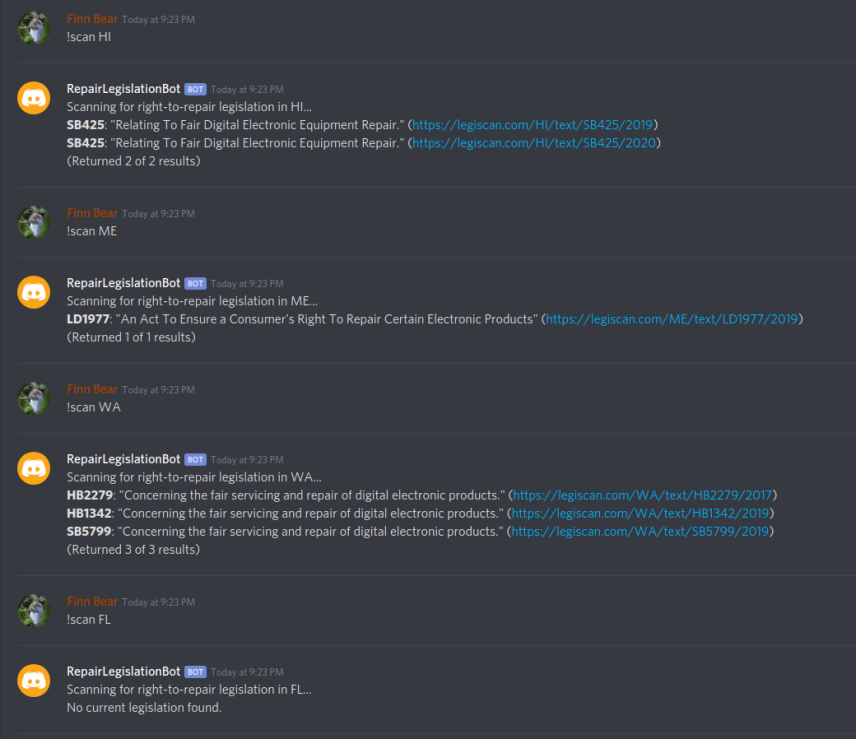

# LegiBot

LegiScan integration for Discord

## Development instructions

- Install `nodejs` version 10(ish)
- Install `axios` and `discord.js` npm packages
- Create a discord bot
- Create a LegiScan api key
- Copy the client id and api key into `credentials.json` mirroring the format of `credentials-template.json`
