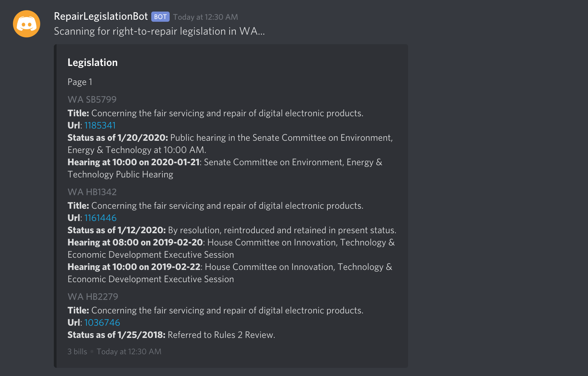

  

# Discord Bot

## Features

- Right to Repair bill tracking and notifications (via the Legiscan API).

## Preview

## Available Commands

| Command                    |                    Description                     |
| -------------------------- | :------------------------------------------------: |
| !ping                      |         Do you really need an explanation?         |
| !help                      | Provides a list of available commands to the user. |
| !scan [state name or code] |   Queries the API for all bills from that state.   |

## Development

### Requirements

- Node.js 'Erbium' (LTS)

### Developing

1. `npm install` or `npm i`
2. `cp credential.json.template credentials.json`
3. Then setup your Discord bot token to the `credentials.json` file
4. `npm start`
5. Happy coding 🎉🙌

### Skipping the annoying hook

We use [Husky](https://github.com/typicode/husky) to run hook at commit.
If you want to skip it add a `--no-verify` to your `git commit`.

## Acknowledgements

- [@finnbear](https://www.gitlab.com/finnbear) as the initial founder of this project.

## License

This project is licensed under [BSD 2-Clause](https://spdx.org/licenses/BSD-2-Clause.html).
